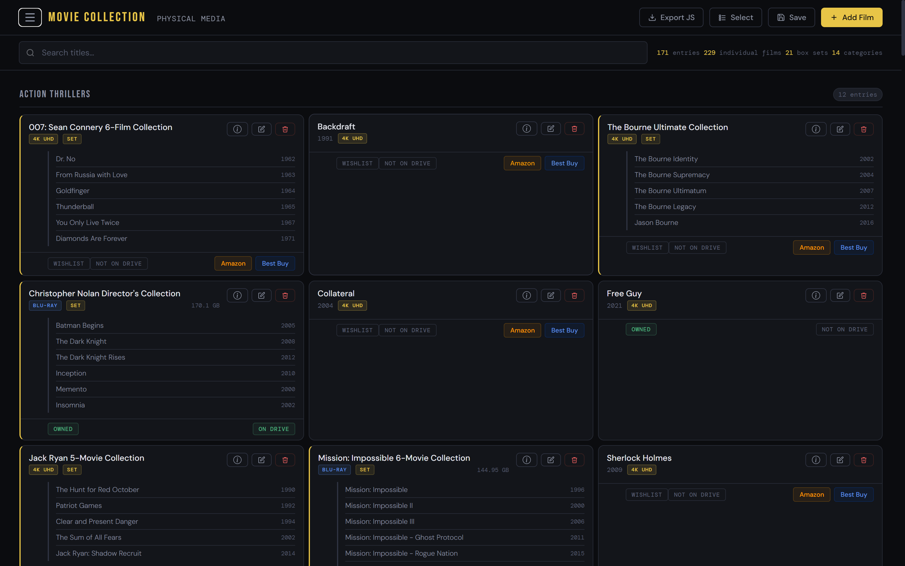
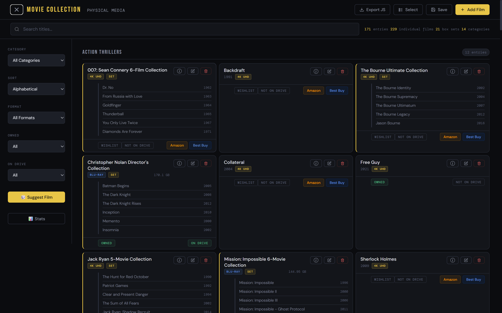
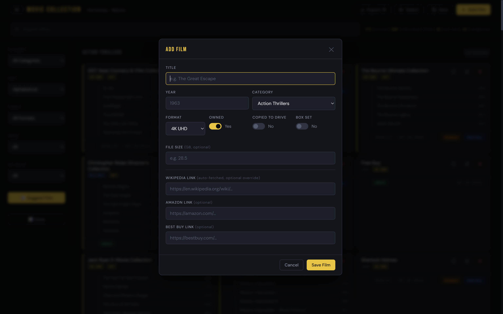
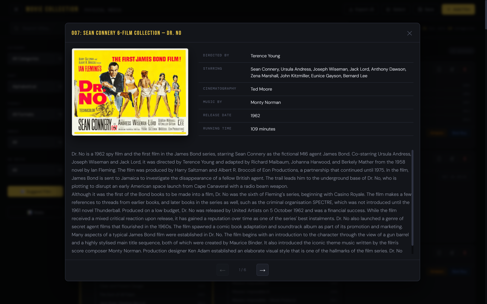
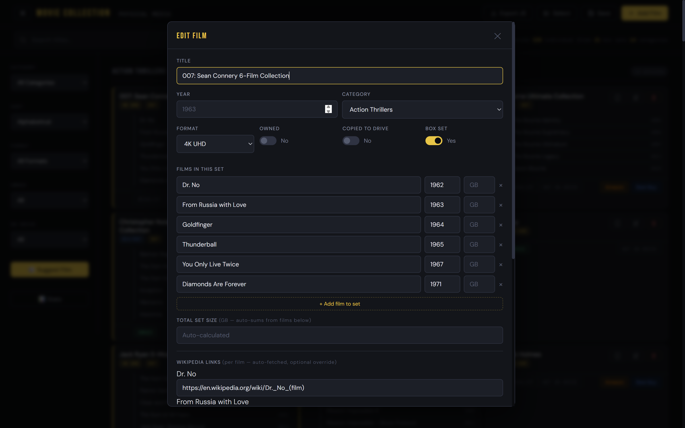
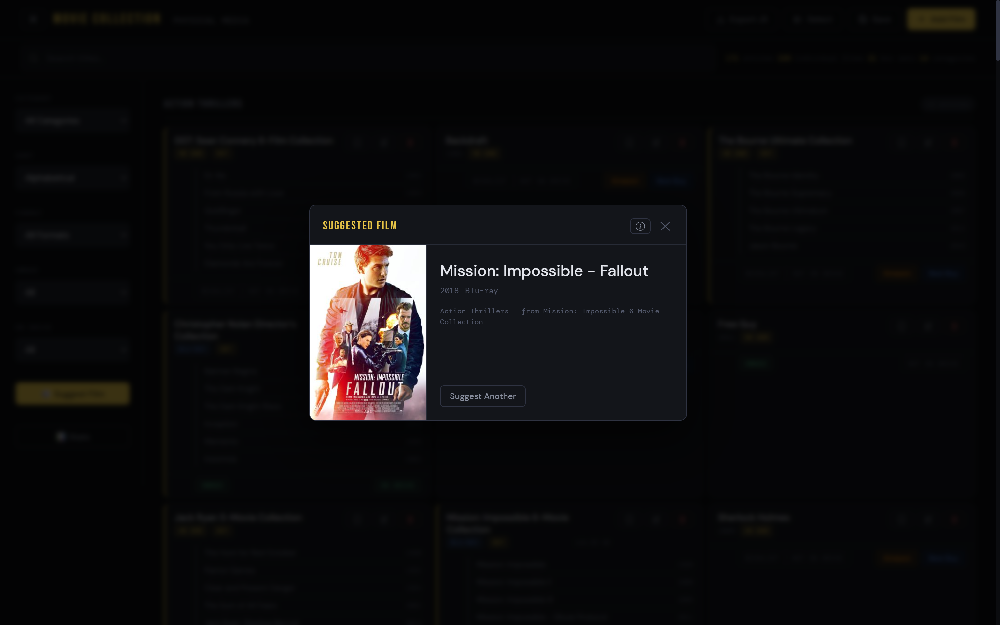
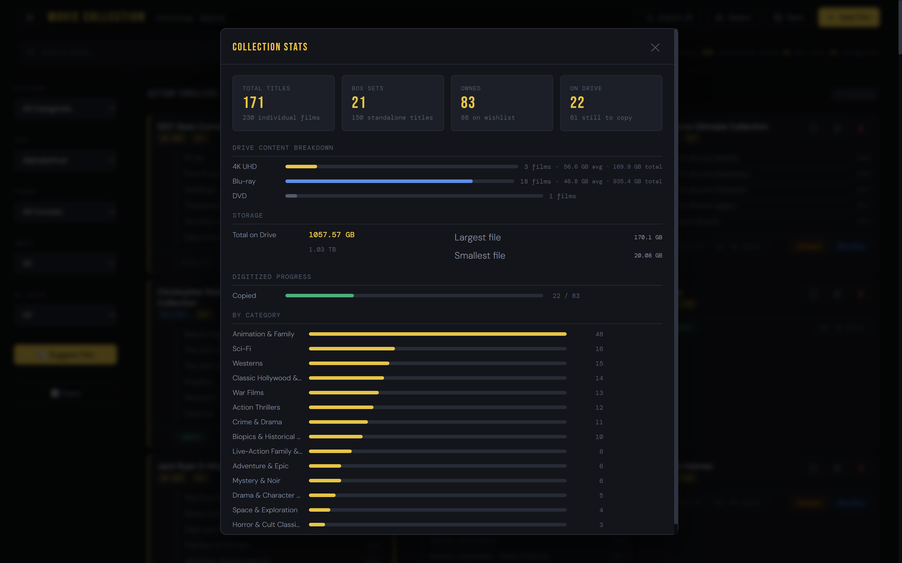

<!-- SHOWCASE: true -->

# Movie Collection Manager

> A zero-dependency browser app for tracking a personal physical media library with filtering, stats, and smart film suggestions.


---

## Project Description

Movie Collection Manager is a high-performance, fully client-side web application designed to catalogue and analyze physical media collections (4K UHD, Blu-ray, and DVD). Built entirely on vanilla web technologies with **zero build steps or external library dependencies**, the application provides robust data modeling for both standalone releases and complex multi-film box sets. 

The app features state preservation across sessions using browser `localStorage` alongside a seamless manual JSON-to-JS export pipeline for machine-agnostic backup. It uniquely integrates dynamic, asynchronous data parsing directly from Wikipedia's live API to generate rich movie details, media poster art, and localized technical specs on demand.

---

## Screenshots / Demo

### Main Application Views
| Primary Dashboard | Active Filter Sidebar |
| :---: | :---: |
| <a href="Demo/Home.png"></a> | <a href="Demo/Filter.png"></a> |

### Library Management & Modals
| Add New Entry | Detailed Film Inspector | Edit Entry State |
| :---: | :---: | :---: |
| <a href="Demo/Add_Film.png"></a> | <a href="Demo/Info_Film.png"></a> | <a href="Demo/Edit_Film.png"></a> |

### Discovery & Analytics
| Active-Filtered Suggestions | Deep Storage Analytics Dashboard |
| :---: | :---: |
| <a href="Demo/Suggest_Film.png"></a> | <a href="Demo/Stats_Film.png"></a> |

---

## Results

Opening `index.html` in any modern browser loads the full collection immediately. The interface shows a card grid with one card per entry. A representative card displays:

- Title, release year, and format badge (4K UHD / Blu-ray / DVD)
- Box set badge and expandable sub-film list when applicable
- Footer with four interactive elements: Owned toggle, On Drive toggle, Amazon link, Best Buy link

The stats dashboard (accessible from the sidebar) reports:

```
Total Titles:  94       Box Sets:   12
Owned:         94       On Drive:    0
Format split:  4K UHD ████████████  94
Digitized:     Copied   0 / 94
By Category:   Westerns ████  14  ...
```

Clicking "Save" writes state to localStorage. Clicking "Export JS" downloads an updated `movies.js` - replace the local copy with this file to persist changes across browsers or machines. If no movies appear on first load, clear the `4k-collection` key from localStorage (DevTools - Application - Local Storage) and refresh.

---

## Key Concepts

`localStorage Persistence` `Client-Side Routing` `Data Migration` `Delegated Event Handling` `Dynamic DOM Rendering` `Collapsible Sidebar` `Weighted Random Selection` `No-Build Vanilla JS`

---

## Languages & Tools

- **Language:** HTML5, CSS3, JavaScript (ES2020)
- **Framework/SDK:** None - vanilla HTML/CSS/JS, no libraries or frameworks
- **Build System:** None - open `index.html` directly in a browser

---

## File Structure

```
Movie-Collection-Manager/
├── index.html    # Application shell, custom SVG iconography, and semantic layouts
├── script.js     # State machines, API abstraction handlers, LRU caching, and DOM reconciliation
├── styles.css    # Strict system variables, application layouts, grid adaptations, and dark mode theme
└── movies.js     # Shared data ecosystem mapping category structural frames and entries
```

Both files must remain in the same directory. `index.html` loads `movies.js` via a `<script>` tag before its own inline script runs.

---

## Data Format

The database is schema-driven inside `movies.js`. The global state cleanly divides items into semantic categories, evaluating individual entries using the following typed objects:

```js
{
  id: "w1",                  // Stable unique identification string
  title: "Winchester '73",   // Display title
  year: 1950,                // Production year integer (null for collective sets)
  format: "4k",              // Media target: "4k" | "bluray" | "dvd"
  owned: true,               // Binary switch flag toggling wishlist status
  digitized: false,          // Backup state tracking local network drive population
  fileSizeGb: 46.2,          // Hardware file size metric storage (optional float)
  isBoxSet: false,           // Structural toggle switching sub-film collection loops
  /* films: [                // Nested items structure used strictly when isBoxSet === true
       { title: "Film Title", year: 1999, fileSizeGb: 22.1, wikiData: { wikiUrl: "..." } }
     ], 
  */
  wikiData: {
    wikiUrl: "https://..."   // Target source record override
  },
  links: {
    amazon: "https://...",   // Linked point-of-sale paths
    bestbuy: "https://..."
  }
}
```

---

## Installation & Usage

No installation, runtime environments, or local servers are required. Clone the repository files and open the primary user interface directly inside any modern web browser.

```bash
# Clone the repository
git clone [https://github.com/alexneilgreen/Movie-Collection-Registry.git](https://github.com/alexneilgreen/Movie-Collection-Registry.git)

# Navigate into the project directory
cd Movie-Collection-Registry

# Open index.html using your operating system's native terminal handler
open index.html        # macOS
start index.html       # Windows
xdg-open index.html    # Linux
```

### Controls

| Action                   | Description                                                                          |
| ------------------------ | ------------------------------------------------------------------------------------ |
| Hamburger button         | Opens and closes the filter sidebar                                                  |
| Filter sidebar           | Filter by category, sort order, format, ownership, and drive status                  |
| Search bar               | Live search by title, including sub-films inside box sets                            |
| Owned / On Drive buttons | One-click toggles on each card, saves immediately                                    |
| Add Film                 | Opens a modal to add a new entry to any category                                     |
| Save                     | Persists current state to localStorage                                               |
| Export JS                | Downloads an updated `movies.js` to replace the local data file                      |
| Suggest Film             | Picks a random owned film from the currently filtered results                        |
| Stats                    | Opens a dashboard with format breakdown, digitized progress, and per-category counts |

---

## License

> _No license specified. All rights reserved by the author._
